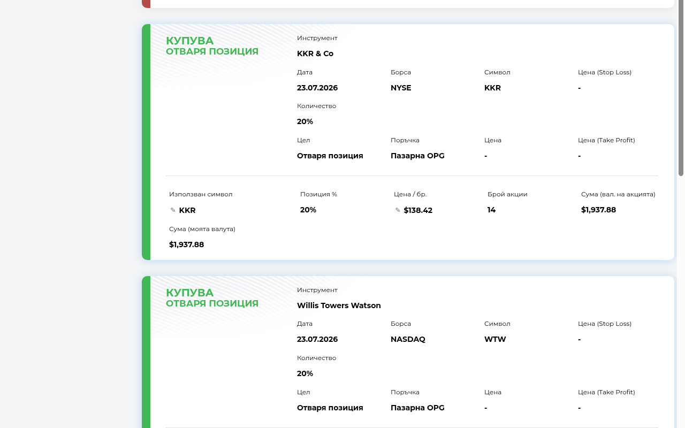
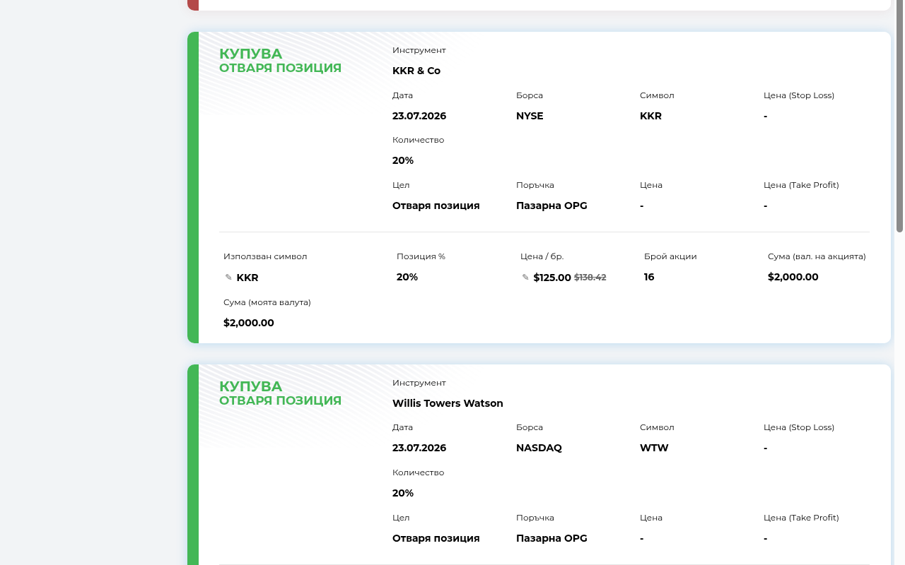
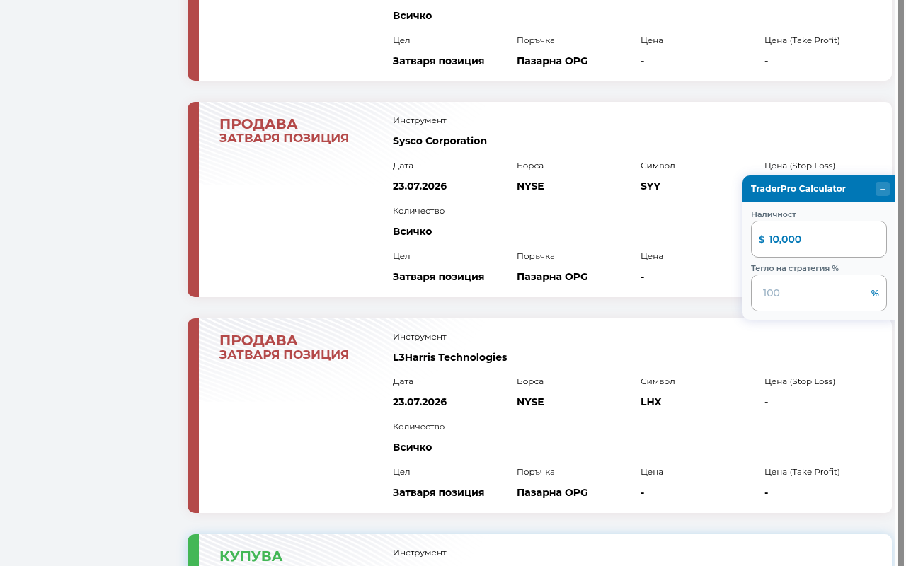

# TraderPro Calculator

An unofficial Chrome extension (Manifest V3) that adds live position-sizing math directly onto [TraderPRO](https://login.traderpro.bg)'s signal cards: current price, the position-size % being used, the resulting share count, and the total cost — in both the stock's own currency and your account currency. Handles plain buy signals, rebalance-to-% signals, and lets you correct a malformed ticker or size off a manually-entered target price, right on the card.

**Not affiliated with TraderPRO. Not financial advice. Always double-check the numbers before placing a trade.**



## What it does

For every **buy** ("КУПУВА" / open-position) and **rebalance** ("Ребалансира до X%") signal card on the TraderPRO signals page, the extension appends a few rows right below the existing ones — separated from them by a single thin divider line — styled like every other field on the card (same fonts/spacing) so they read as a natural part of it rather than a bolted-on box.

**Plain buy signals** get:
- **Използван символ** — the ticker actually used for pricing this card (normally the site's own scraped symbol; editable, see below).
- **Позиция %** — the position size actually being used: the signal's own stated %, scaled by your strategy weight if you've set one (see [Strategy weight](#strategy-weight-not-per-signal)). The site's own "Количество" field is never touched — this is a separate, read-only display.
- **Цена / бр.**, **Брой акции**, and the total cost in both the stock's own currency and your account currency.

**Rebalance-to-% signals** ("Ребалансира" — adjust this position to become X% of the portfolio) get the same ticker/price rows, plus:
- **Целеви %** — the signal's target %, scaled by strategy weight the same way.
- **Текущи акции** — an editable field for how many shares you currently hold of that instrument (the one thing this extension can't observe on its own).
- **Целеви акции**, **Действие** (buy/sell/hold), and **Стойност на сделката** — the actual trade needed to reach the target.

If a signal's own text can't be confidently classified (an unrecognized phrasing), the extension shows a manual type/%-picker instead of guessing — your choice is remembered for that signal.

Sell/close-position signals ("ПРОДАВА") are left completely untouched.

The same information is also available in the extension's popup (click the toolbar icon) for a quick, read-only summary without scrolling through the page.

## Editing a malformed ticker or sizing off a target price



Two fields on every buy/rebalance card have a small pencil (✎) icon next to them:

- **Използван символ** — if a signal's ticker is malformed or doesn't resolve to a quote, click the pencil, type the correct symbol, and confirm. This only changes which symbol *this extension* uses for its own price lookup — it never touches the real TraderPRO page's own ticker text. The original scraped ticker stays visible, struck through, next to your correction.
- **Цена / бр.** — click the pencil to enter a target price (e.g. a signal that says "buy at X" rather than at market). Once set, every other computed number on that card (shares, totals, or target-shares/action/trade-value for a rebalance) is sized off your target price instead of the live quote. The live quote is still fetched and shown struck through next to it, so you can see both.

Both corrections apply only to that one signal — a later signal for the same ticker starts fresh rather than inheriting an old correction — and both save automatically (debounced, with a small ✓ confirming the save) and sync across your own signed-in Chrome instances.

## Installation (unpacked — not yet on the Chrome Web Store)

This extension isn't published on the Chrome Web Store, so it's loaded as an "unpacked" extension straight from this folder — the standard way to run a local/dev Chrome extension.

1. Download or `git clone` this repository somewhere permanent on disk (don't install from a temp folder — Chrome re-reads the extension from this location every time it loads, and deleting/moving the folder later will break or remove the extension).
2. Open `chrome://extensions` in Chrome (type it directly into the address bar — it's a special internal page, not something you can search to).
3. Turn on **Developer mode** using the toggle in the top-right corner. This unlocks the **Load unpacked** button (without it, Chrome only accepts extensions from the Web Store).
4. Click **Load unpacked**, then select this project's root folder (the one containing `manifest.json`).
5. The extension now appears in your extensions list as "TraderPro Calculator" and its icon appears in the toolbar (you may need to click the puzzle-piece icon in the toolbar and pin it for quicker access).
6. Chrome grants the extension's declared permissions automatically at load time for unpacked extensions — see [Enabling site access](#enabling-site-access-chrome-permissions) below if you ever need to double-check or fix this.
7. Continue to [Getting started](#getting-started-first-time-setup) below to set your account balance and start using it.

To update later (e.g. after pulling new changes), go back to `chrome://extensions` and click the refresh icon on the extension's card — Chrome doesn't auto-reload unpacked extensions when the files on disk change.

## Enabling site access (Chrome permissions)

The extension needs Chrome's permission to talk to a small, fixed set of hosts — declared in `manifest.json`'s `host_permissions` and requested up front, not asked for one-by-one at runtime:

| Host | Why |
|---|---|
| `login.traderpro.bg` | Where the content script runs — this is what reads the signal cards and injects the sizing rows onto the page. |
| `query1.finance.yahoo.com`, `query2.finance.yahoo.com` | Live share price and FX rates (primary source). |
| `stooq.com` | Fallback price source if Yahoo is unreachable. |
| `api.frankfurter.app` | Fallback FX-rate source if Yahoo's FX pseudo-tickers are unreachable. |

For an unpacked extension loaded via **Load unpacked**, Chrome grants all of these automatically — there's no separate "Allow" click needed, and no permissions popup to accept. You only need to actively check this if the extension seems to not be working on the TraderPRO page (no sizing rows appear, or the popup shows nothing):

1. Go to `chrome://extensions`, find "TraderPro Calculator", and click **Details**.
2. Scroll to **Site access** and confirm it's set to **On specific sites** (with `login.traderpro.bg` listed) or **On all sites** — not **On click**. If it's set to **On click**, the content script won't automatically run on page load; switch it to **On specific sites**.
3. Alternatively, on the TraderPRO page itself, click the puzzle-piece icon in Chrome's toolbar, find the extension, and make sure it isn't paused/blocked for that site.
4. If you changed anything, reload the TraderPRO signals page for it to take effect.

The extension also requests two non-host permissions: `storage` (to save your balance/settings/per-signal corrections via `chrome.storage.sync`) and `scripting` (used only as a fallback — if the popup can't reach an already-loaded content script on the active tab, it re-injects the content script *and* the floating widget via `chrome.scripting.executeScript` so both still work right after installing, before you've reloaded the TraderPRO tab).

## Getting started (first-time setup)

1. Log into `login.traderpro.bg` in a tab and open the strategy/signals page.
2. A small floating panel appears docked to the right edge of the page (see below). Type your account balance into the **Наличност** field there. This is the only place your balance is set.
3. Buy and rebalance signal cards on the page should now show a live price, share count, and total cost. If nothing appears, see [Enabling site access](#enabling-site-access-chrome-permissions) above.
4. Optionally set your account currency and rounding preference on the Options page (right-click the toolbar icon → Options, or click **Настройки** in the popup) — see [Configuring](#configuring) below.

## Configuring

### Balance and strategy weight (floating widget on the page)



Both your account balance and your strategy weight are configured in **exactly one place: the floating widget** that appears on the TraderPRO page itself, docked to the right edge of the screen — no need to open the toolbar popup at all.

- **Наличност (balance)** is the top field, since it's the one that changes daily.
- **Тегло на стратегия % (strategy weight)** sits right below it. It's a multiplier, not a substitute: leave it empty and it's treated as 100% (every signal uses its own TraderPRO-stated/target % unscaled); type a number and *every* signal's % is multiplied by that value ÷ 100 — e.g. 50% halves every resulting position size, 150% scales it up by half. Applies uniformly to both plain buy signals and rebalance-to-% signals (a rebalance-to-10% signal at 50% weight effectively targets 5%), since different strategies/providers may warrant different portfolio allocations.

Both fields save automatically as you type (debounced ~300ms, with a small ✓ confirming the save) and instantly recompute every share count/total, both next to the signals and in the toolbar popup (which shows a read-only summary of both values). Neither has a field on the Options page.

Click the **–** button in the widget's header to minimize it to a small tab docked at the same spot — click the tab again to expand it back. Your minimized/expanded preference is remembered across page reloads.

The account currency and rounding mode change far less often, so those stay on the Options page (right-click the toolbar icon → Options, or click **Настройки** in the popup).

### Strategy weight is global — per-signal corrections are per-signal

The strategy weight above is a **single, portfolio-wide** setting — there's no way to size just one signal differently from the rest without temporarily changing (and then changing back) the global value. That's a deliberate choice: it's a policy about how much of your portfolio a given strategy/provider gets, not a per-trade adjustment.

The **ticker override** and **target price** described in [Editing a malformed ticker or sizing off a target price](#editing-a-malformed-ticker-or-sizing-off-a-target-price) are the opposite: they're deliberately per-signal, because they exist to fix something specific to *that one card* (a bad symbol, a stated entry price) rather than to express a portfolio-wide policy.

### Account currency and rounding (Options page)

| Setting | What it does |
|---|---|
| **Account currency** | The currency your balance (set in the floating widget, see above) is denominated in. |
| **Rounding mode** | See below. |

Changes on the Options page save automatically (same debounce-and-confirm behavior as the widget) and immediately update any signals already showing on the TraderPRO page or in the popup, including the widget's currency prefix.

### Rounding modes

- **Raw** — show the exact, unrounded share count (e.g. `41.87`). Useful if you trade fractional shares manually.
- **Always round down** — floor to the nearest whole share (conservative, never overspends your target allocation).
- **Round up if the extra cost is below a threshold** — you set a threshold amount in your account currency. If rounding up to the next whole share costs less than that threshold, it rounds up; otherwise it rounds down. Example: raw = 41.87 shares at $50/share. Rounding up to 42 costs `(42 − 41.87) × $50 = $6.50` extra. If your threshold is $10, it rounds up to 42; if your threshold is $5, it rounds down to 41.

## Using the extension day-to-day

Once your balance is set (see [Getting started](#getting-started-first-time-setup)), there's nothing else to do — the extension works passively:

- **On the TraderPRO page**: every buy/rebalance signal card automatically gets its sizing rows appended below its existing fields, separated by a thin divider. New cards that load in later (e.g. after scrolling or filtering signals) are picked up automatically — no need to refresh the page.
- **The floating widget**: docked to the right edge of the page (see [Configuring](#configuring)), always there for editing balance/strategy weight or checking the currently-set values, without switching tabs or clicking the toolbar icon. Minimize it out of the way with its **–** button whenever you don't need it.
- **In the popup**: click the toolbar icon any time for a compact signals list plus a read-only summary of the current balance/strategy weight, without needing to be looking at the TraderPRO tab.
- **Source badges**: if a price or FX rate came from a fallback source (Stooq instead of Yahoo, or Frankfurter/the BGN peg instead of Yahoo FX) rather than the primary one, a small badge appears next to that signal (e.g. "цена: stooq (прибл.)") so you know it's an approximation — see [How prices and FX rates are fetched](#how-prices-and-fx-rates-are-fetched) below.
- **Errors**: if a price/FX lookup fails for a signal (e.g. an unrecognized ticker, or all sources down), that signal shows a "Грешка: …" message in place of its numbers — use the ticker pencil (see [above](#editing-a-malformed-ticker-or-sizing-off-a-target-price)) to correct it if the ticker itself is the problem.
- **Editing balance or strategy weight**: any change in the floating widget instantly recalculates every visible signal, both on the TraderPRO page and in the popup's summary — there's no separate "apply"/"refresh" step.
- **Rebalance signals**: enter your current shares once per instrument (see [What it does](#what-it-does)) — it's remembered per ticker and carries over to every card for that instrument, on every tab.
- **Sell signals** ("ПРОДАВА") are always left as-is; only buy and rebalance signals get sizing math.

## How prices and FX rates are fetched

- **Price**: [Yahoo Finance's public chart endpoint](https://query1.finance.yahoo.com/v8/finance/chart/) (unofficial, no API key) is tried first. If it fails, the extension falls back to [Stooq](https://stooq.com/)'s free CSV quote endpoint.
- **FX conversion**: Yahoo's currency-pair pseudo-tickers (e.g. `EURUSD=X`) are tried first, falling back to [Frankfurter.app](https://api.frankfurter.app/) (free ECB reference rates), and — only for the EUR↔BGN pair — a fixed fallback using Bulgaria's legal currency-board peg (1 EUR = 1.95583 BGN) if both network sources fail.
- When a fallback source is used, a small "source: stooq (approx.)" style badge appears next to the numbers so you know it isn't the primary, higher-confidence source.
- A target price override (see [Editing a malformed ticker or sizing off a target price](#editing-a-malformed-ticker-or-sizing-off-a-target-price)) replaces the live quote *only* as the input to the sizing formula — the live quote is still fetched and still drives FX conversion and the struck-through comparison value.

## Privacy / security

- No API keys, credentials, or secrets are embedded in this extension, and none are required to use it — the Yahoo/Stooq/Frankfurter endpoints used are all free and keyless.
- Your account balance, preferences, and any per-signal ticker/price corrections are stored only in your browser via `chrome.storage.sync` (which syncs across your own signed-in Chrome instances) — nothing is sent to any server the extension's authors control, because there isn't one.
- This is a deliberate design choice so the extension can be shared/published without anyone needing to trust a backend or hand over secrets.

## Known limitations

- Yahoo Finance's chart endpoint is unofficial and could change or start blocking requests without notice — the Stooq fallback exists for this reason but only covers US-listed tickers and doesn't report currency (assumed USD).
- Tickers are used as-is (no exchange-suffix mapping like `.L` for London), since TraderPRO's strategies currently trade only US-listed S&P 500 stocks — the ticker-override pencil (see above) is the workaround if a specific signal's symbol doesn't resolve.
- The strategy weight is global only — there's no way to scale one particular signal differently from the rest without temporarily changing (and then changing back) the global value. (Per-signal ticker/target-price corrections are a separate, intentionally per-signal mechanism — see [Strategy weight is global](#strategy-weight-is-global--per-signal-corrections-are-per-signal).)

## Roadmap

- **Live IBKR balance** — pull your real account balance from Interactive Brokers via their Client Portal Gateway (a small app IBKR provides that you'd run and log into locally), instead of manually entering it. Deferred because it requires the user to run that local gateway; manual entry works today with zero setup.
- Non-US ticker support if TraderPRO ever signals non-S&P-500 instruments.

## Project structure

```
manifest.json              MV3 manifest — permissions, host permissions, content script registration
shared/                    Plain-JS modules shared across contexts:
                             storage.js (settings), positions.js (holdings + per-signal overrides),
                             classify.js (signal-type/ticker-alias parsing), sizing.js (position-size math),
                             scrape.js (DOM reading), format.js, messaging.js, quotes.js, fx.js
background/background.js   Service worker — routes quote/FX requests, caches responses for 60s
content/content.js         Content script — scrapes signal cards, injects the sizing UI (incl. the
                             ticker/target-price edit controls), watches for DOM changes
content/widget.js          Content script — floating balance/strategy-weight widget docked to the page's right edge
popup/                     Toolbar popup — mirrors the signals list, shows a read-only balance/weight summary
options/                   Settings page — currency, rounding mode (balance/weight are set in the floating widget)
icons/                     Extension icons (ascending bar-chart glyph on a rounded square; icon-source.svg is the editable source)
store-assets/screenshots/  Chrome Web Store listing screenshots (see PUBLISHING.md)
```

See `CLAUDE.md` for a deeper architecture/conventions reference aimed at whoever (human or AI) works on this codebase next.
